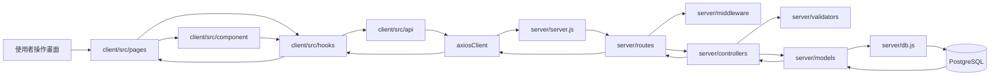
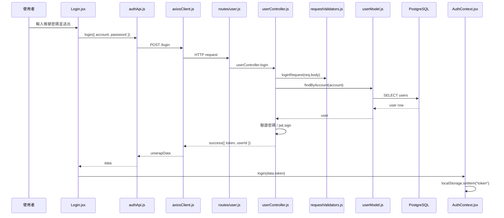

# Tutor Management 前後端完整流程

這份文件用目前 codebase 的實際結構，整理每個資料夾、每個主要檔案的責任，以及前端到後端、後端到資料庫之間的互動流程。

後端目前統一採用這個拆法：

```txt
routes -> controllers -> models -> db
```

`services/` 先不使用。現在的功能大多是 CRUD 或輕量跨表流程，用 `controller + model` 就夠清楚。等流程變成「付款後要更新學生狀態、建立提醒、發通知、寫 log、呼叫第三方 API」這種跨很多領域的情況，再加 `services/` 會比較自然。

## 1. 全專案資料流總覽



一個使用者操作通常會長這樣：

```txt
使用者點按鈕 / 送出表單
-> page 或 component 收到事件
-> 呼叫 hook 裡的 function
-> hook 呼叫 api helper
-> axiosClient 發 HTTP request
-> server route 接到 URL
-> authMiddleware 驗證 token
-> controller 驗證 request 並決定流程
-> model 執行 SQL
-> db.js 的 pool 連 PostgreSQL
-> controller 用 success/fail 回 JSON
-> axiosClient 收 response
-> hook 更新 data/loading/error
-> page/component 重新渲染畫面
```

## 2. 根目錄檔案

| 檔案 / 資料夾 | 角色 | 互動對象 |
|---|---|---|
| `client/` | React + Vite 前端 | 呼叫 `server/` API |
| `server/` | Express + PostgreSQL 後端 | 接收 `client/` request，讀寫資料庫 |
| `README.md` | 專案基本說明 | 給開發者快速看 |
| `FRONTEND_BACKEND_FLOW.md` | 本文件，詳細流程說明 | 用來理解整個 codebase |
| `AGENTS.md` | repo 工作規則 | 給 Codex / agent 參考 |
| `package.json`、`package-lock.json` | 根目錄 npm 設定 | 目前主要依賴仍在 `client/`、`server/` 各自管理 |

## 3. 前端資料夾與檔案互動

### 3.1 `client/` 根目錄

| 檔案 | 角色 | 誰會用到 |
|---|---|---|
| `client/package.json` | 前端 scripts 與依賴 | `npm run dev`、`npm run build`、`npm run lint` |
| `client/vite.config.js` | Vite 設定 | Vite dev server / build |
| `client/index.html` | React 掛載點，提供 `#root` | `main.jsx` 用 `createRoot` 掛上 App |
| `client/eslint.config.js` | ESLint 設定 | `npm run lint` |
| `client/tailwind.config.js` | Tailwind 設定 | CSS class 掃描與產生 |
| `client/postcss.config.js` | PostCSS 設定 | Tailwind / CSS build |
| `client/public/tm-icon.svg` | 靜態 icon | 前端頁面或瀏覽器資源 |

### 3.2 `client/src/main.jsx`

這是前端真正的入口。

```txt
index.html
-> 找到 <div id="root">
-> main.jsx
-> createRoot(document.getElementById("root"))
-> <AuthProvider>
-> <App />
```

它做兩件事：

1. 載入全域 CSS：`client/src/style/index.css`
2. 用 `AuthProvider` 包住整個 `App`

因為 `AuthProvider` 包在最外層，所以所有頁面都可以透過 `useAuth()` 取得登入狀態。

### 3.3 `client/src/App.jsx`

`App.jsx` 負責前端路由。

| URL | Page | 是否需要登入 | 流程 |
|---|---|---|---|
| `/` | `Home.jsx` | 否 | 首頁，決定導到登入或課程頁 |
| `/login` | `Login.jsx` | 否 | 登入表單 |
| `/course` | `Course.jsx` | 是 | 外層包 `ProtectedRoute` |
| `/class` | `Class.jsx` | 是 | 外層包 `ProtectedRoute` |
| `/class/seat/:scheduleId` | `Seat.jsx` | 是 | 外層包 `ProtectedRoute`，從 URL 取得 `scheduleId` |

互動關係：

```txt
App.jsx
-> createBrowserRouter
-> ProtectedRoute 判斷登入
-> 顯示對應 pages/*
```

### 3.4 `client/src/context/`

| 檔案 | 角色 | 主要互動 |
|---|---|---|
| `AuthContext.jsx` | 管理 token、登入、登出、JWT decode | 被 `main.jsx` 掛在最外層 |
| `authContext.js` | 建立 context / 匯出 `useAuth` | 被 `Login.jsx`、`ProtectedRoute.jsx`、`Home.jsx` 使用 |

登入狀態流程：

```txt
Login.jsx 登入成功
-> useAuth().login(token)
-> AuthContext.jsx 把 token 存入 localStorage
-> AuthContext.jsx decode token
-> isAuthenticated = true
-> ProtectedRoute 放行受保護頁面
```

token 失效流程：

```txt
axiosClient 收到 401
-> localStorage.removeItem("token")
-> window.dispatchEvent("auth:expired")
-> AuthProvider 監聽事件
-> logout()
-> isAuthenticated = false
-> ProtectedRoute 導回 /login
```

### 3.5 `client/src/api/`

前端 API helper 都放這裡。page 和 component 不直接寫 axios，會透過 hook 再呼叫這些 API helper。

| 檔案 | 提供 function | 對應後端 |
|---|---|---|
| `axiosClient.js` | `apiClient`、`unwrapData`、`getApiErrorMessage` | 所有 API 共用 |
| `authApi.js` | `login` | `POST /login` |
| `courseApi.js` | `listCourses`、`createCourse`、`deleteCourse` | `/courses` |
| `classApi.js` | `listClasses`、`listSeats`、`updateSeat` | `/classes`、`/classes/:scheduleId/seats` |
| `reminderApi.js` | `listReminders`、`createReminder`、`deleteReminder` | `/reminder` |
| `paymentApi.js` | `listPayments`、`createBillingPeriod`、`updateBillingPeriod`、`updatePaymentStatus` | `/classes/:scheduleId/payments`、`/classes/:scheduleId/billing-periods` |

`axiosClient.js` 是 API 層的中心：

```txt
api helper
-> apiClient.get/post/patch/delete
-> request interceptor 自動加 Authorization
-> 後端回應
-> response interceptor 處理 401
-> unwrapData 拿 response.data.data
```

`unwrapData()` 的用途是讓 hook 拿到真正資料，不需要每次都寫：

```js
response.data.data
```

### 3.6 `client/src/hooks/`

hooks 是前端資料流的中間層。它讓 page 不需要直接處理 API 細節。

| 檔案 | 負責資料 | 呼叫哪個 API |
|---|---|---|
| `useAsyncData.js` | 共用 `data/loading/error/refresh` | 不固定，由參數 `loadData` 決定 |
| `useCourses.js` | 課程列表、課表格式、新增/刪除課程 | `courseApi.js` |
| `useClasses.js` | 班級列表 | `classApi.listClasses` |
| `useSeats.js` | 座位列表、座位 map、儲存座位 | `classApi.listSeats/updateSeat` |
| `useReminders.js` | 提醒列表、新增/刪除提醒 | `reminderApi.js` |
| `usePayments.js` | 期別列表與選擇、總覽統計、建立／編輯期別、更新繳費狀態 | `paymentApi.js` |

共用讀取流程：

```txt
page 呼叫 useCourses()
-> useCourses 呼叫 useAsyncData(listCourses)
-> useAsyncData refresh()
-> listCourses()
-> API response
-> setData(result)
-> page 取得 courses/loading/error
```

寫入後重新整理流程：

```txt
page 呼叫 hook function，例如 addCourse()
-> hook 呼叫 createCourse()
-> 後端新增成功
-> hook 呼叫 state.refresh()
-> 重新 GET 最新資料
-> page 更新
```

### 3.7 `client/src/pages/`

pages 是路由層級元件，負責組合 component、hook 和頁面狀態。

| 檔案 | 角色 | 呼叫的 hook / API | 使用的 component |
|---|---|---|---|
| `Home.jsx` | 首頁 | `useAuth` | `Navbar`、`Carousel` |
| `Login.jsx` | 登入頁 | `authApi.login`、`useAuth` | 無主要子元件 |
| `Course.jsx` | 課程表頁 | `useCourses` | `Navbar`、`ShowCourse`、`AddCourse` |
| `Class.jsx` | 班級列表頁 | `useClasses` | `Navbar` |
| `Seat.jsx` | 單一班級管理頁 | `useSeats`、`useParams` | `Navbar`、`SeatGrid`、`AddSeat`、`Reminder`、`Payment` |

頁面之間的關係：

```txt
Home.jsx
-> 如果已登入，導到 /course
-> 如果未登入，導到 /login

Login.jsx
-> 登入成功後導到 /course

Course.jsx
-> 管理 schedule/course

Class.jsx
-> 顯示每個 schedule 對應的 class
-> 點擊班級 Link 到 /class/seat/:scheduleId

Seat.jsx
-> 用 scheduleId 管理座位 / 提醒 / 繳費
```

### 3.8 `client/src/component/`

components 是畫面元件。多數 component 不直接打 API，而是透過 props 呼叫 page 傳進來的 handler。少數功能型 component 會直接使用 hook，例如 `Reminder`、`Payment`。

| 檔案 | 角色 | 資料從哪裡來 | 事件往哪裡送 |
|---|---|---|---|
| `Navbar.jsx` | 導覽列 / 登入狀態相關 UI | `useAuth` | 登出或導頁 |
| `ProtectedRoute.jsx` | 保護需要登入的頁面 | `useAuth` | 未登入導到 `/login` |
| `Carousel.jsx` | 首頁輪播內容 | 靜態/元件內資料 | 無主要 API |
| `Sidebar.jsx` | 側邊欄 | 視 UI 使用 | 視 UI 使用 |
| `ShowCourse.jsx` | 顯示課表 | `Course.jsx` props | 刪除課程事件往 `Course.jsx` |
| `CourseTable.jsx` | 課表表格元件 | 課程表資料 props | 刪除/操作事件往上層 |
| `AddCourse.jsx` | 新增課程表單 | 元件內 form state | `onCreate(course)` 給 `Course.jsx` |
| `SeatGrid.jsx` | 座位格狀 UI | `Seat.jsx` 傳入 `seatMap` | 點座位呼叫 `onSeatClick(seatId)` |
| `AddSeat.jsx` | 新增/更新座位學生 modal | 元件內姓名 state | `onSave(name)` 給 `Seat.jsx` |
| `Reminder.jsx` | 提醒列表容器 | `useReminders(scheduleId)` | 新增/刪除提醒 |
| `AddReminder.jsx` | 新增提醒 modal | 元件內 form state | `onCreate(payload)` 給 `Reminder.jsx` |
| `ReminderCard.jsx` | 提醒卡片 | `Reminder.jsx` props | 切換/開詳細 |
| `ReminderDetailModal.jsx` | 提醒詳細 modal | `Reminder.jsx` props | 刪除/關閉 |
| `Payment.jsx` | 期別選擇、統計卡、學生繳費明細與 modal 協調 | `usePayments(scheduleId)` | 建立／編輯期別、切換繳費狀態 |
| `PaymentCard.jsx` | 單一學生固定應繳金額與狀態卡 | `Payment.jsx` props | `onToggle(payment)` |
| `BillingPeriodModal.jsx` | 收費期別表單與每人應繳試算 | 元件內 form state | `onSubmit(period)` 給 `Payment.jsx` |

component 典型互動：

```txt
AddCourse.jsx 表單 submit
-> 呼叫 props.onCreate(payload)
-> Course.jsx handleCreateCourse
-> useCourses.addCourse
-> courseApi.createCourse
-> 後端 API
```

### 3.9 `client/src/style/`

| 檔案 | 角色 | 誰使用 |
|---|---|---|
| `index.css` | 全域 CSS / Tailwind base | `main.jsx` |
| `App.css` | app 層級樣式與自訂 class | `App.jsx` |

畫面元件主要透過 className 使用這些樣式，例如 `tm-page`、`tm-shell`、`tm-card`、`tm-primary-btn` 等。

## 4. 後端資料夾與檔案互動

### 4.1 `server/server.js`

這是後端入口。

```txt
server/server.js
-> dotenv 讀 server/.env
-> express()
-> cors(corsOptions)
-> express.json()
-> app.use("/", userRoutes)
-> app.use("/", courseRoutes)
-> app.use("/", classRoutes)
-> app.use("/", reminderRoutes)
-> app.use("/", paymentRoutes)
-> app.use(errorHandler)
-> app.listen(config.port)
```

它不處理任何業務功能，只負責把 Express app 組起來。

### 4.2 `server/config/index.js`

集中讀取環境變數。

| 設定 | 用途 | 使用者 |
|---|---|---|
| `port` | Express port | `server.js` |
| `clientOrigins` | CORS 允許來源 | `server.js` |
| `jwtSecret` | JWT 簽章密鑰 | `userController.js`、`auth.js` |
| `jwtExpiresIn` | JWT 有效時間 | `userController.js` |
| `nodeEnv`、`isProduction` | 環境判斷 | 後續可擴充 |

### 4.3 `server/db.js`

建立 PostgreSQL pool。

```txt
models/*
-> require("../db")
-> pool.query(...)
-> PostgreSQL
```

它支援兩種連線方式：

1. `DATABASE_URL`
2. `db_user`、`db_host`、`db_database`、`db_password`、`db_port`

如果是 Supabase 或設定 `DB_SSL=true`，會加上 SSL 設定。

### 4.4 `server/routes/`

routes 只負責 URL 對應和 middleware，不寫 SQL、不寫主要流程。

| 檔案 | 掛載 endpoint | 呼叫 controller |
|---|---|---|
| `user.js` | `GET /success`、`POST /login` | `userController` |
| `course.js` | `GET/POST /courses`、`DELETE /courses/:scheduleId`，也保留舊路徑 | `courseController` |
| `class.js` | `GET /classes`、`GET/PATCH /classes/:scheduleId/seats`，也保留舊路徑 | `classController` |
| `reminder.js` | `GET/POST /reminder`、`DELETE /reminder/:id` | `reminderController` |
| `payment.js` | 讀取繳費總覽、建立／編輯期別、更新單筆繳費狀態 | `paymentController` |

route 檔的基本形狀：

```js
router.use(authMiddleware);
router.get("/courses", asyncHandler(courseController.listCourses));
```

這代表：

```txt
request 進來
-> 先跑 authMiddleware
-> 再跑 asyncHandler(controller)
-> controller 如果 throw error，asyncHandler 會交給 errorHandler
```

`user.js` 的 `/login` 不需要 `authMiddleware`，因為登入前還沒有 token。

### 4.5 `server/controllers/`

controllers 是後端流程控制層。它知道 HTTP request/response，也知道要呼叫哪個 model。

| 檔案 | 責任 | 主要呼叫 |
|---|---|---|
| `userController.js` | 登入、健康檢查 | `userModel.findByAccount`、`jwt.sign` |
| `courseController.js` | 課程列表、新增、刪除 | `courseModel`、`withTransaction` |
| `classController.js` | 班級列表、座位列表、更新座位 | `classModel`、`withTransaction` |
| `reminderController.js` | 提醒列表、新增、刪除 | `reminderModel` |
| `paymentController.js` | 讀取繳費總覽、建立／更新收費期別、更新單筆繳費狀態 | `paymentModel`、`withTransaction` |

controller 的典型責任：

```txt
1. 從 req.params / req.query / req.body 取資料
2. 呼叫 validator 驗證格式
3. 從 req.user.id 取得目前使用者
4. 呼叫 model 查詢或寫入 DB
5. 必要時用 withTransaction 包多個 SQL
6. 用 success(res, data) 回傳
7. 錯誤時 throw HttpError
```

### 4.6 `server/models/`

models 是 SQL 層。它不知道 Express，也不直接處理 HTTP response。

| 檔案 | 對應資料 | 主要 function |
|---|---|---|
| `userModel.js` | `users` | `findByAccount` |
| `courseModel.js` | `schedule`、`class` | `createSchedule`、`createClass`、`listByUserId`、`deleteSchedule` |
| `classModel.js` | `class`、`class_members`、`students` | `getClassesByUserId`、`findClassByScheduleForUser`、`upsertStudent`、`createClassMember` |
| `reminderModel.js` | `reminders`、`schedule` | `findOwnedSchedule`、`createReminder`、`listByUserId`、`deleteByIdForUser` |
| `paymentModel.js` | `billing_periods`、`payments`、`class_members`、`students` | `listPeriods`、`listPaymentsByPeriod`、`createBillingPeriod`、`createPaymentsForPeriod`、`updatePaymentStatus` |

model 的典型形狀：

```js
const result = await pool.query("SELECT ...", [params]);
return result.rows;
```

如果 controller 開了 transaction，model 會接收 `client` 或 `db`：

```txt
controller
-> withTransaction(async (client) => {
     courseModel.createSchedule(client, ...)
   })
```

這樣同一個流程中的多個 SQL 可以一起 `COMMIT` 或一起 `ROLLBACK`。

### 4.7 `server/validators/`

| 檔案 | 角色 |
|---|---|
| `requestValidators.js` | 驗證所有 request body、params、query |

它會把原始 request 轉成 controller 好用的格式。

例子：

```txt
courseRequest(req.body)
-> 驗證 course_name 必填
-> 驗證 weekday 是 1~7
-> 驗證 start_time/end_time 是 HH:mm
-> 驗證 end_time 晚於 start_time
-> 回傳 { courseName, weekday, startTime, endTime }
```

validator 如果發現錯誤，會丟 `HttpError(400, ...)`，最後由 `errorHandler` 回傳 JSON。

### 4.8 `server/middleware/`

| 檔案 | 角色 | 在哪裡使用 |
|---|---|---|
| `auth.js` | 驗證 JWT，設定 `req.user` | 需要登入的 routes |
| `asyncHandler.js` | 包 async controller，把錯誤丟給 `next` | routes |
| `errorHandler.js` | 統一處理錯誤 response | `server.js` 最後掛載 |

JWT 驗證流程：

```txt
request header Authorization: Bearer <token>
-> authMiddleware
-> jwt.verify(token, config.jwtSecret)
-> 成功：req.user = { id, account }
-> 失敗：回 401 JSON
```

### 4.9 `server/utils/`

| 檔案 | 角色 | 誰使用 |
|---|---|---|
| `response.js` | `success()`、`fail()` 統一 JSON 格式 | controllers、middleware |
| `httpError.js` | 自訂錯誤類別，帶 `statusCode/code/details` | controllers、validators |
| `transaction.js` | `withTransaction()` 包 DB transaction | controllers |

`withTransaction` 流程：

```txt
pool.connect()
-> BEGIN
-> 執行 callback(client)
-> 成功 COMMIT
-> 失敗 ROLLBACK
-> release client
```

## 5. 登入完整流程



對應檔案：

```txt
client/src/pages/Login.jsx
-> client/src/api/authApi.js
-> client/src/api/axiosClient.js
-> server/routes/user.js
-> server/controllers/userController.js
-> server/validators/requestValidators.js
-> server/models/userModel.js
-> server/db.js
```

## 6. 課程完整流程

### 6.1 課程列表

```txt
Course.jsx
-> useCourses()
-> useAsyncData(listCourses)
-> courseApi.listCourses()
-> axiosClient.get("/courses")
-> routes/course.js GET /courses
-> authMiddleware
-> courseController.listCourses
-> courseModel.listByUserId(req.user.id)
-> db.js pool.query
-> success(res, courses)
-> useAsyncData setData(courses)
-> useCourses buildCourseTable(courses)
-> Course.jsx 傳給 ShowCourse
```

### 6.2 新增課程

```txt
AddCourse.jsx
-> 使用者填 course_name / weekday / start_time / end_time
-> onCreate(payload)
-> Course.jsx handleCreateCourse
-> useCourses.addCourse
-> courseApi.createCourse
-> POST /courses
-> courseController.createCourse
-> courseRequest 驗證
-> withTransaction
   -> courseModel.createSchedule
   -> courseModel.createClass
-> success
-> useCourses.refresh
-> 重新 GET /courses
```

新增課程牽涉兩張表：

| table | 做什麼 |
|---|---|
| `schedule` | 存課程名稱、星期、開始時間、結束時間、user_id |
| `class` | 存這個課程對應的班級資料，後續座位/學生會依賴它 |

### 6.3 刪除課程

```txt
ShowCourse.jsx
-> 點刪除
-> Course.jsx handleDeleteCourse
-> useCourses.removeCourse
-> courseApi.deleteCourse(scheduleId)
-> DELETE /courses/:scheduleId
-> courseController.deleteCourse
-> scheduleIdParam 驗證
-> withTransaction
   -> courseModel.findOwnedSchedule 確認課程屬於目前使用者
   -> courseModel.deleteClassBySchedule
   -> courseModel.deleteSchedule
-> refresh courses
```

## 7. 班級與座位完整流程

### 7.1 班級列表

```txt
Class.jsx
-> useClasses()
-> classApi.listClasses()
-> GET /classes
-> routes/class.js
-> authMiddleware
-> classController.listClasses
-> classModel.getClassesByUserId(req.user.id)
-> SQL JOIN class + schedule + class_members
-> 回傳 class_id / schedule_id / course_name / student_count
-> Class.jsx 顯示班級卡片
-> Link 到 /class/seat/:scheduleId
```

### 7.2 座位列表

```txt
Seat.jsx
-> useParams() 取得 scheduleId
-> useSeats(scheduleId)
-> classApi.listSeats(scheduleId)
-> GET /classes/:scheduleId/seats
-> classController.getSeats
-> scheduleIdParam 驗證
-> classModel.findClassByScheduleForUser
-> classModel.getSeatMembersByClassId
-> 回傳 [{ seat_id, name }]
-> useSeats.toSeatMap
-> SeatGrid 用 seatMap 顯示座位姓名
```

`useSeats` 會把 array 轉成物件，方便座位格直接查：

```js
{
  "A1": "小明",
  "A2": "小華"
}
```

### 7.3 更新座位

```txt
SeatGrid.jsx
-> 使用者點座位
-> Seat.jsx handleSeatClick(seatId)
-> 開 AddSeat.jsx
-> 使用者輸入 name
-> Seat.jsx handleSaveSeat(name)
-> useSeats.saveSeat({ seatId, name })
-> classApi.updateSeat({ scheduleId, seatId, name })
-> PATCH /classes/:scheduleId/seats/:seatId
-> classController.updateSeat
-> seatUpdateRequest 驗證
-> withTransaction
   -> classModel.findClassByScheduleForUser(..., forUpdate)
   -> 如果 name 空白：deleteClassMemberBySeat
   -> 如果 name 有值：upsertStudent
   -> assignSeatToStudent
      -> findClassMemberBySeat
      -> deleteConflictingClassMembers
      -> createClassMember
-> success
-> refresh seats
```

這是目前後端最複雜的 controller，因為「改座位」不只是改一筆資料，它同時會影響：

| table | 原因 |
|---|---|
| `students` | 學生姓名要存在學生表 |
| `class_members` | 學生和班級、座位的關係 |

座位異動只更新目前的 `students` 與 `class_members`。付款資料會在建立收費期別時一次依目前班級名單產生快照，因此後續座位異動不影響歷史期別。

## 8. 提醒完整流程

### 8.1 提醒列表

```txt
Seat.jsx activeTab = reminders
-> Reminder.jsx
-> useParams() 取得 scheduleId
-> useReminders(scheduleId)
-> reminderApi.listReminders(scheduleId)
-> GET /reminder?scheduleId=<id>
-> reminderController.listReminders
-> reminderListRequest 驗證 query
-> reminderModel.listByUserId({ userId, scheduleId })
-> SQL LEFT JOIN schedule
-> 回傳 reminders
-> ReminderCard 顯示目前提醒
-> ReminderDetailModal 顯示詳細內容
```

### 8.2 新增提醒

```txt
AddReminder.jsx
-> 使用者輸入 title / content / date / time
-> 組成 payload:
   title
   description
   remind_date
   remind_at
   schedule_id
-> Reminder.jsx handleCreateReminder
-> useReminders.addReminder
-> reminderApi.createReminder
-> POST /reminder
-> reminderController.createReminder
-> reminderCreateRequest 驗證
-> reminderModel.findOwnedSchedule 確認 schedule 屬於目前使用者
-> reminderModel.createReminder
-> success
-> refresh reminders
```

### 8.3 刪除提醒

```txt
ReminderDetailModal.jsx
-> 使用者點刪除
-> Reminder.jsx onDelete
-> useReminders.removeReminder(current.id)
-> reminderApi.deleteReminder(id)
-> DELETE /reminder/:id
-> reminderController.deleteReminder
-> reminderIdParam 驗證
-> reminderModel.deleteByIdForUser({ id, userId })
-> success
-> refresh reminders
```

刪除時會帶 `userId`，所以只能刪自己的提醒。

## 9. 繳費完整流程

### 9.1 讀取最新或指定期別

```txt
Seat.jsx activeTab = payments
-> Payment.jsx
-> useParams() 取得 scheduleId
-> usePayments(scheduleId)
-> paymentApi.listPayments(scheduleId, periodId)
-> GET /classes/:scheduleId/payments?periodId=<id>
-> paymentController.listPayments
-> paymentListRequest 驗證
-> paymentModel.listPeriods({ scheduleId, userId })
-> 預設選最新期別，或選 periodId 指定的歷史期別
-> paymentModel.listPaymentsByPeriod(...)
-> 回傳 current_period、periods、payments、summary
-> Payment.jsx 顯示期別資訊、統計卡與 PaymentCard
```

`summary` 由後端依該期別的 payment rows 統計，包含總應收、已收、未收，以及已繳／未繳人數，所以每次開啟或切換期別都會取得最新數字。

### 9.2 建立收費期別

```txt
BillingPeriodModal.jsx
-> 輸入開始／結束日期、實際堂數、每堂單價
-> usePayments.createPeriod
-> POST /classes/:scheduleId/billing-periods
-> paymentController.createBillingPeriod
-> billingPeriodCreateRequest 驗證並計算 lessonCount × unitPrice
-> withTransaction
   -> 鎖定使用者擁有的班級
   -> 確認日期沒有重疊
   -> paymentModel.createBillingPeriod
   -> paymentModel.createPaymentsForPeriod 快照目前 class_members
   -> 班級沒有學生時回滾
-> 回傳新期別 overview
```

同一期別所有學生的 `amount_due` 都是固定金額。之後座位名單改變時，既有期別的 payment rows 不會跟著增減。

### 9.3 更新繳費狀態

```txt
PaymentCard.jsx 點「標記已繳」或「改回未繳」
-> usePayments.setPaymentStatus
-> PATCH /classes/:scheduleId/payments/:paymentId
-> paymentController.updatePaymentStatus
-> paymentStatusUpdateRequest 只接受 status
-> withTransaction 鎖定班級與 payment
-> paymentModel.updatePaymentStatus
   -> 已繳：保留或寫入 paid_at
   -> 未繳：清除 paid_at
-> 重新讀取 overview，畫面同步更新統計
```

### 9.4 編輯期別

只有整個期別目前都是未繳時才能修改。`PATCH /classes/:scheduleId/billing-periods/:periodId` 會在同一個 transaction 內更新日期、堂數與單價，並把所有學生的 `amount_due` 一起重算；只要仍有任一學生已繳即回傳 `409 BILLING_PERIOD_LOCKED`。

## 10. 後端 API 對照表

| 功能 | Method | Path | Route | Controller | Model |
|---|---|---|---|---|---|
| 健康檢查 | GET | `/success` | `routes/user.js` | `userController.healthCheck` | 無 |
| 登入 | POST | `/login` | `routes/user.js` | `userController.login` | `userModel.findByAccount` |
| 課程列表 | GET | `/courses` | `routes/course.js` | `courseController.listCourses` | `courseModel.listByUserId` |
| 新增課程 | POST | `/courses` | `routes/course.js` | `courseController.createCourse` | `courseModel.createSchedule/createClass` |
| 刪除課程 | DELETE | `/courses/:scheduleId` | `routes/course.js` | `courseController.deleteCourse` | `courseModel.findOwnedSchedule/delete*` |
| 班級列表 | GET | `/classes` | `routes/class.js` | `classController.listClasses` | `classModel.getClassesByUserId` |
| 座位列表 | GET | `/classes/:scheduleId/seats` | `routes/class.js` | `classController.getSeats` | `classModel.findClassByScheduleForUser/getSeatMembersByClassId` |
| 更新座位 | PATCH | `/classes/:scheduleId/seats/:seatId` | `routes/class.js` | `classController.updateSeat` | `classModel.*` |
| 提醒列表 | GET | `/reminder?scheduleId=` | `routes/reminder.js` | `reminderController.listReminders` | `reminderModel.listByUserId` |
| 新增提醒 | POST | `/reminder` | `routes/reminder.js` | `reminderController.createReminder` | `reminderModel.findOwnedSchedule/createReminder` |
| 刪除提醒 | DELETE | `/reminder/:id` | `routes/reminder.js` | `reminderController.deleteReminder` | `reminderModel.deleteByIdForUser` |
| 繳費總覽 | GET | `/classes/:scheduleId/payments?periodId=` | `routes/payment.js` | `paymentController.listPayments` | `paymentModel.listPeriods/listPaymentsByPeriod` |
| 建立收費期別 | POST | `/classes/:scheduleId/billing-periods` | `routes/payment.js` | `paymentController.createBillingPeriod` | `paymentModel.createBillingPeriod/createPaymentsForPeriod` |
| 編輯收費期別 | PATCH | `/classes/:scheduleId/billing-periods/:periodId` | `routes/payment.js` | `paymentController.updateBillingPeriod` | `paymentModel.updateBillingPeriod/updatePaymentAmounts` |
| 更新繳費狀態 | PATCH | `/classes/:scheduleId/payments/:paymentId` | `routes/payment.js` | `paymentController.updatePaymentStatus` | `paymentModel.updatePaymentStatus` |

後端目前仍為課程與座位保留部分舊 endpoint，例如 `/course`、`/showcourse`、`/class`、`/seat/:scheduleId`。付款功能只使用上表的新 REST 路徑。

## 11. 資料表關係概念

```mermaid
erDiagram
    users ||--o{ schedule : owns
    users ||--o{ class : owns
    users ||--o{ students : owns
    users ||--o{ reminders : owns
    schedule ||--|| class : creates
    schedule ||--o{ reminders : has
    schedule ||--o{ billing_periods : has
    class ||--o{ class_members : contains
    students ||--o{ class_members : joins
    billing_periods ||--o{ payments : contains
    students ||--o{ payments : billed
```

資料表互動重點：

| 功能 | 主要表 | 連動表 |
|---|---|---|
| 登入 | `users` | 無 |
| 新增課程 | `schedule` | `class` |
| 班級列表 | `class` | `schedule`、`class_members` |
| 更新座位 | `students` | `class_members` |
| 提醒 | `reminders` | `schedule` |
| 繳費 | `billing_periods`、`payments` | 建立期別時讀取 `class_members`、`students` |

`billing_periods` 以 exclusion constraint 保證同班日期不重疊，`amount_per_student` 是由堂數與單價計算的 generated column；`payments` 保證同一期別同一學生只有一筆，且 `status` 必須與 `paid_at` 一致。兩張表已啟用 RLS 並撤銷 `anon`／`authenticated` 權限，TutorFlow 由 Express 透過 PostgreSQL 連線存取。

## 12. 新增一個功能時要怎麼放檔案

假設要新增「學生備註」功能，可以照這個順序：

```txt
1. server/models/studentNoteModel.js
   -> 寫 SQL，例如 listNotes/createNote/deleteNote

2. server/controllers/studentNoteController.js
   -> 驗證 request
   -> 呼叫 studentNoteModel
   -> success(res, data)

3. server/routes/studentNote.js
   -> router.use(authMiddleware)
   -> router.get/post/delete(...)

4. server/server.js
   -> app.use("/", studentNoteRoutes)

5. client/src/api/studentNoteApi.js
   -> listNotes/createNote/deleteNote

6. client/src/hooks/useStudentNotes.js
   -> 用 useAsyncData 包 loading/error/refresh

7. client/src/component 或 pages
   -> 做畫面與事件
```

判斷要不要新增 `services/`：

| 先不要 services | 可以考慮 services |
|---|---|
| 單純 CRUD | 一個流程跨很多表又跨很多功能 |
| controller 邏輯還能一眼看懂 | 多個 controller 共用同一套業務規則 |
| 只需要呼叫一兩個 model | 同時要 DB、外部 API、排程、通知 |

目前專案維持 `routes -> controllers -> models -> db` 最好讀。
